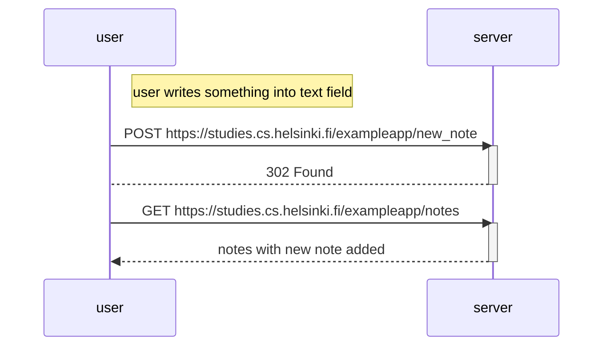

```mermaid
sequenceDiagram
    participant user
    participant server

    note right of user: user writes something into text field

    user->>server: POST https://studies.cs.helsinki.fi/exampleapp/new_note
    activate server
    server-->user: 302 Found
    deactivate server

    user->>server: GET https://studies.cs.helsinki.fi/exampleapp/notes
    activate server
    server-->>user: notes with new note added
    deactivate server
```
