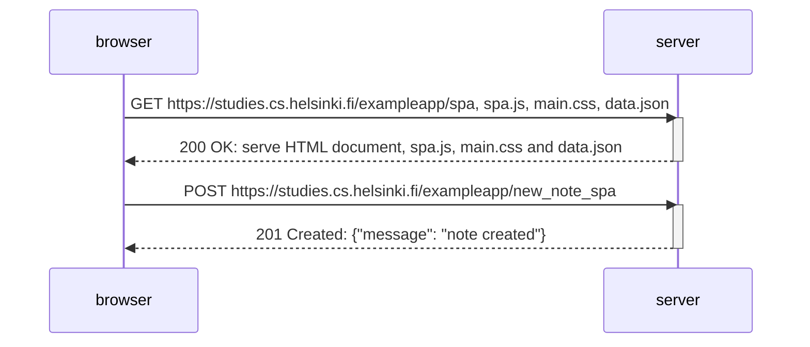

```mermaid
sequenceDiagram
    participant browser
    participant server

    browser->>server: GET https://studies.cs.helsinki.fi/exampleapp/spa, spa.js, main.css, data.json
    activate server
    server-->>browser: 200 OK: serve HTML document, spa.js, main.css and data.json
    deactivate server

    browser->>server: POST https://studies.cs.helsinki.fi/exampleapp/new_note_spa
    activate server
    server-->>browser: 201 Created: {"message": "note created"}
    deactivate server

```
