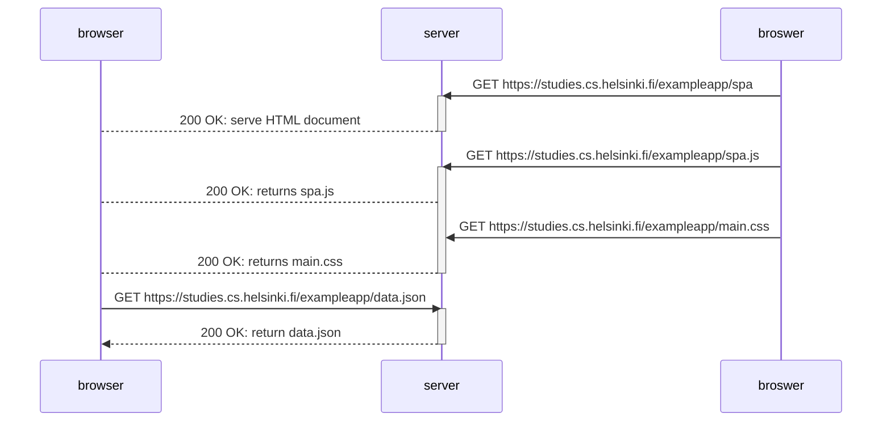

```mermaid
sequenceDiagram
    participant browser
    participant server


    broswer->>server: GET https://studies.cs.helsinki.fi/exampleapp/spa
    activate server
    server-->browser: 200 OK: serve HTML document
    deactivate server

    broswer->>server: GET https://studies.cs.helsinki.fi/exampleapp/spa.js
    activate server
    server-->browser: 200 OK: returns spa.js
    broswer->>server: GET https://studies.cs.helsinki.fi/exampleapp/main.css
    server-->browser: 200 OK: returns main.css
    deactivate server

    browser->>server: GET https://studies.cs.helsinki.fi/exampleapp/data.json
    activate server
    server-->>browser: 200 OK: return data.json
    deactivate server

```
